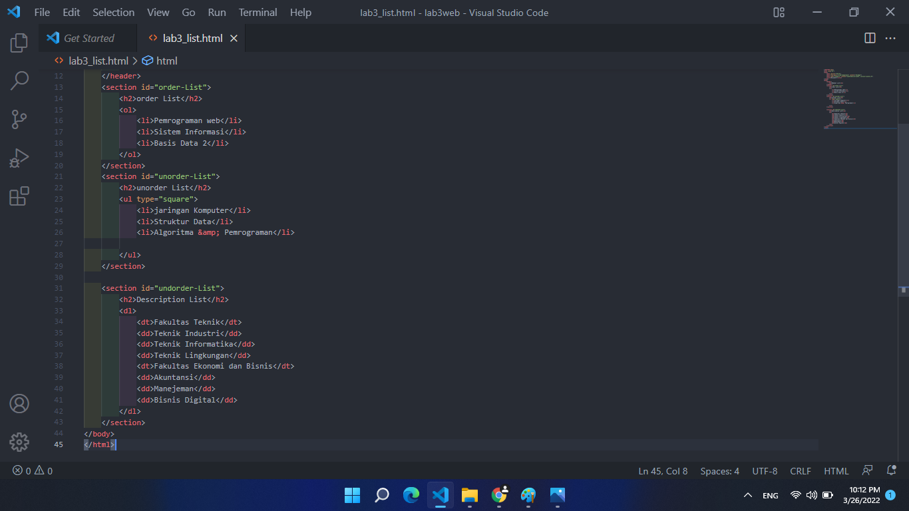
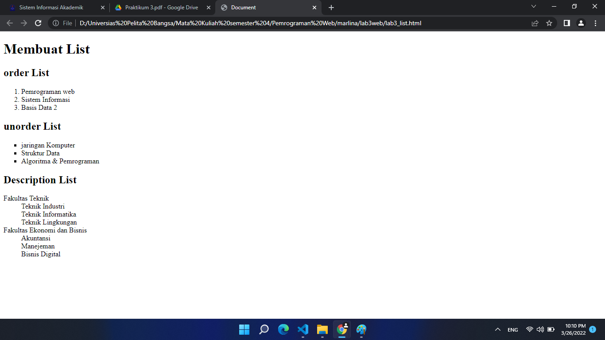
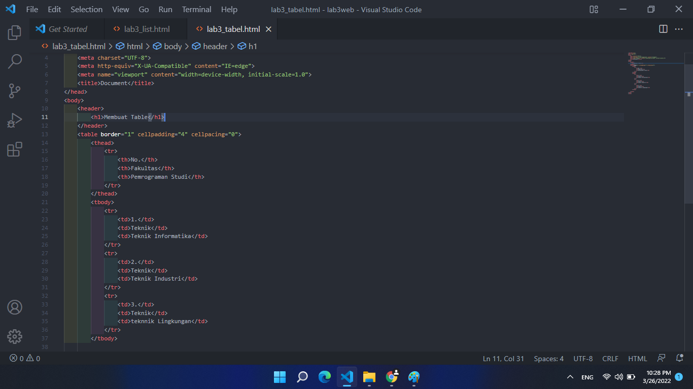
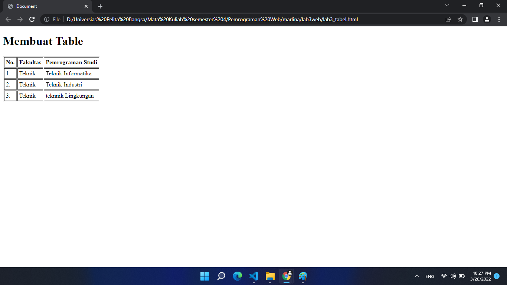
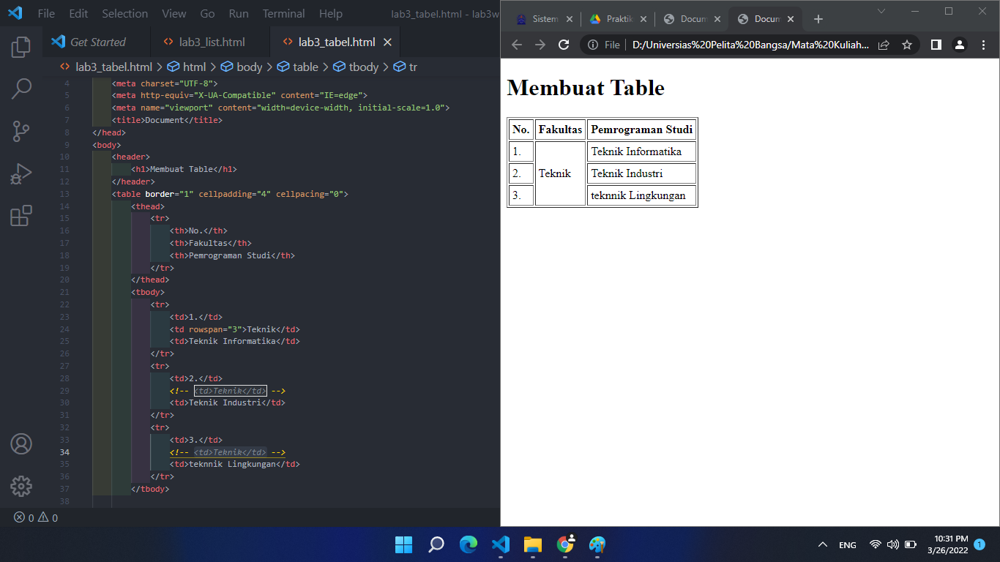
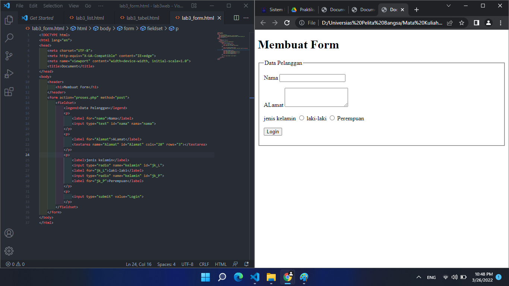
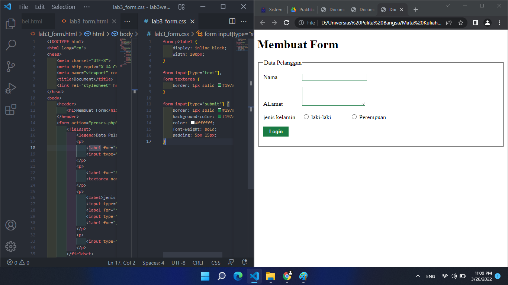
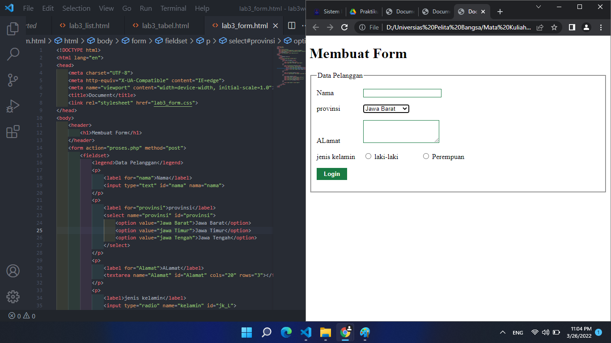

# Lab3Web
HTML Lanjutan

## HTML list

1. pertama membuat struktur `html`

            <!DOCTYPE html>
            <html lang="en">
            <head>
                <meta charset="UTF-8">
                <meta http-equiv="X-UA-Compatible" content="IE=edge">
                <meta name="viewport" content="width=device-width, initial-scale=1.0">
                <title>Document</title>
            </head>
            <body>

            </body>
            </html>

2. membuat **Ordered List**, **Unordered List** & **Description List**

maka akan tampil sebagai berikut

## HTML Tabel
1. pertama membuat struktur `html`

            <!DOCTYPE html>
            <html lang="en">
            <head>
                <meta charset="UTF-8">
                <meta http-equiv="X-UA-Compatible" content="IE=edge">
                <meta name="viewport" content="width=device-width, initial-scale=1.0">
                <title>Document</title>
            </head>
            <body>

            </body>
            </html>

2. Penjelasan HTML table. Tabel (Table) adalah sebuah data tabular dalam bentuk grid yang terdiri dari kolom (column), baris (row) dan celll yang merupakan pertemuan antara kolom dan baris. HTML <table> element merepresentasikan data dengan lebih dari satu dimensi dalam bentuk sebuah tabel (table).

tag yang ada di dalam table
1. td (Table Data) : digunakan untuk membuat kolom dan disisipkannya data.
2. tr ( Table Row) : digunakan untuk membuat baris table.
3. th (Table Header) : fungsinya sama seperti tag td, tetapi terletak di baris pertama dan sebagai header dari table.

3. masukkan kode berikut ini

refresh browsur maka akan menampilkan tabel sebagai berikut

cara menggabungkan tabel

## HTML Form

1. membuat struktur html
2. masukkan kode membuat Form maka akan tampil sebagai berikut

3. memberi sedikit style pada Form

4. memberikan dropdown dan list box

